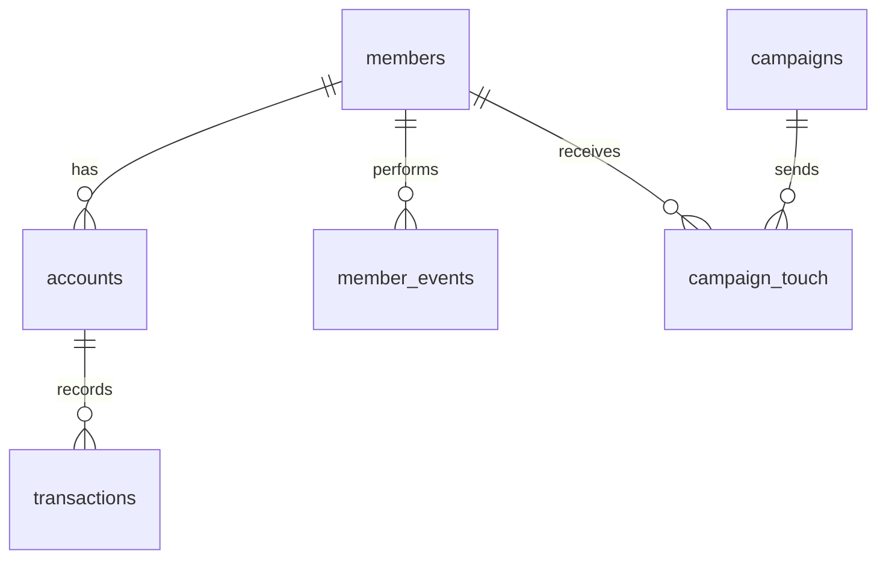

# 🏦 Credit Union Growth Analytics  
### End-to-End SQL Marketing & Retention Analysis (DuckDB Project)
---

## 🧭 Overview

This project simulates the **data analytics workflow of a Credit Union Growth Strategy team** — analyzing member acquisition, engagement, and retention using SQL inside **DuckDB**.  

It demonstrates a full **end-to-end analytical process**, from raw CSV ingestion to engineered views, KPI tracking, business insights, and export-ready results.  

The dataset mimics a real-world **member lifecycle and campaign effectiveness environment**, similar to how a marketing analytics or growth team at a financial institution would operate.

---
<p align="center">
  
  
  
  
  
</p>

---

## 🚀 Quickstart (Run in 60 Seconds)

Clone the repo and open DuckDB CLI from the project root:

```sql
.open credit_union.duckdb;
SET schema 'cu';

-- Run setup and analysis scripts
.read sql/01_setup_and_views.sql
.read sql/02_q01_to_q22.sql
```

All paths are **relative to the repo root**, so it runs anywhere without editing.

Outputs (views + answers) are written to:  
`/outputs/` → summarized views  
`/outputs/answers/` → Q1–Q22 final CSVs

---

## 🧭 Mini ERD (Schema Overview)



This diagram shows how the six raw CSVs relate inside DuckDB:
- **members** → central entity  
- **accounts** & **transactions** → financial behavior  
- **member_events** → digital activity  
- **campaigns** & **campaign_touch** → marketing engagement  

---

## 🎯 Project Objectives

1. **Build a unified member analytics framework** across multiple business data sources.  
2. **Evaluate campaign effectiveness** (CPA, ROI, conversion, funding).  
3. **Measure engagement, churn, and retention** over time and by member segment.  
4. **Develop actionable insights** for marketing and product teams.  
5. **Simulate an industry-standard workflow** — from SQL and data engineering to dashboards.

---

## 🧩 Dataset Schema

The raw data consists of **6 base CSVs**, each representing a key operational dataset:

| File | Description |
|------|--------------|
| `members.csv` | Member demographics, language preference, join date, and churn flag |
| `accounts.csv` | Financial accounts (checking, savings, loans, etc.) linked to members |
| `transactions.csv` | Deposit and withdrawal data by account and date |
| `campaigns.csv` | Marketing campaign metadata (channel, budget, dates) |
| `campaign_touch.csv` | Individual campaign touches, open/click/convert activity |
| `member_events.csv` | Digital behavior logs — app logins, feature usage, event tracking |

All CSVs are loaded into DuckDB as external tables using `read_csv_auto()`.

---

## 🏗️ Data Engineering (Stage 1 → Views)

From these 6 raw tables, we engineered **9 analytical views**, each serving a specific purpose in the member and campaign lifecycle:

| View | Purpose | Engineered Columns |
|------|----------|--------------------|
| `v_members_raw` | Clean copy of members dataset | — |
| `v_accounts_raw` | Clean copy of accounts dataset | — |
| `v_transactions_raw` | Clean copy of transactions dataset | — |
| `v_campaigns_raw` | Clean copy of campaign definitions | — |
| `v_campaign_touch_raw` | Clean copy of touch-level data | — |
| `v_member_events_raw` | Clean copy of member event logs | — |
| **`v_transactions_monthly`** | Monthly aggregates of deposits, withdrawals, and net activity | `txn_month`, `deposits_month`, `withdrawals_month`, `net_month` |
| **`v_member_events_monthly`** | Monthly digital activity count per member | `event_month`, `monthly_event_count` |
| **`v_member_base`** | Member-level engineered features | `age_band`, `zip3`, `is_spanish` |
| **`v_account_summary`** | Account-level features by member | `accounts_count`, `tenure_months`, `total_balance`, `avg_interest_rate` |
| **`v_member_360`** | Unified member view for all modeling and analysis | Combines all above (full feature set) |

📂 Each view was saved to `/outputs/` for validation as CSV samples.

---

## 📊 Analytical Workflow (Stage 2 → Q01–Q22)

After data integration, the project answers **22 structured analytical questions**.  
Each question represents a distinct business problem or KPI scenario relevant to credit union growth and retention.

| # | Business Question | Output |
|---|--------------------|---------|
| **Q01** | Sanity check: Row counts for all source tables | `q01_sanity_counts.csv` |
| **Q02** | Campaign funnel performance (touch → open → click → convert) | `q02_campaign_funnel.csv` |
| **Q03** | Cost per Acquisition (CPA) by campaign | `q03_cpa_by_campaign.csv` |
| **Q04** | Campaign ROI: deposit lift ± budget | `q04_campaign_roi.csv` |
| **Q05a–c** | Top/bottom campaigns by CPA and ROI | `q05a_top5_by_cpa.csv`, etc. |
| **Q06** | Median days from first touch → funded account | `q06_median_days_to_fund.csv` |
| **Q07** | Monthly Active Members (MAM) and activity rate | `q07_mam_activity_rate.csv` |
| **Q08** | Engagement tiers by age band and signup channel | `q08_engagement_tiers_by_segment.csv` |
| **Q09** | Churn rate by segment | `q09_churn_rate_by_segment.csv` |
| **Q10** | Deposit growth (MoM) by channel | `q10_deposit_growth_mom_by_channel.csv` |
| **Q11** | New members by signup channel | `q11_new_members_by_channel.csv` |
| **Q12** | Funding rate by campaign | `q12_funding_rate_by_campaign.csv` |
| **Q13** | Dormant members (>60 days inactive) | `q13_dormant_members.csv` |
| **Q14** | Cross-sell opportunities (checking-only members) | `q14_cross_sell_checking_only.csv` |
| **Q15** | Average monthly engagement by age band | `q15_avg_monthly_engagement_by_age.csv` |
| **Q16** | First-touch channel with highest conversion | `q16_first_touch_channel_conversion.csv` |
| **Q17** | Retention lift: touched vs. not-touched members | `q17_retention_lift_campaign_touched.csv` |
| **Q18** | Pareto analysis: top 20% deposit share | `q18_top20pct_share_of_deposits.csv` |
| **Q19** | Spanish-preference member performance | `q19_spanish_pref_touch_and_fund.csv` |
| **Q20** | ZIP3-level deposits and conversions | `q20_zip_deposits_and_conv.csv` |
| **Q21** | Correlation between tenure and engagement | `q21_tenure_activity_correlation.csv` |
| **Q22** | Next-best campaign targeting | `q22_next_best_campaign_targets.csv` |

---

## 💡 Stage 3 — Insights & Recommendations (Q23)

### [Stage 3 — Insights & Recommendations](./insight&recommendations.md)
See the full analysis and business recommendations in the [Q23 Insights Report](./insight&recommendations.md).

Key highlights:
- 20–25% budget reallocation opportunity toward high-ROI channels  
- 17-point retention lift via digital onboarding  
- Cross-sell and reactivation pathways for checking-only members  
- CRM lead scoring logic from the Next-Best-Campaign model (Q22)

---

## 📈 Stage 4 — Dashboards & Visualization (Q24)

Final deliverable (coming next):
- **Tableau Public dashboard** for visual storytelling (member funnel, CPA, ROI, churn trends).
- **Power BI interactive report** for campaign and retention monitoring.
- Optional: **Marketo / CRM integration mockup** for automated campaign scoring.

---

## ⚙️ Technology Stack

| Category | Tools |
|-----------|--------|
| Database | DuckDB |
| Query Language | SQL (DuckDB syntax) |
| Visualization | Power BI, Tableau |
| Data Export | CSV via DuckDB COPY command |
| Version Control | Git + GitHub |
| Editor | VS Code + DuckDB CLI |
| OS | Windows 11 (local dev) |

---

## 🧱 Folder Structure

```plaintext
credit_union_growth/
├── data/                     # 6 source CSVs
├── sql/                      # SQL scripts
│   ├── 01_setup_and_views.sql
│   ├── 02_q01_to_q22.sql
├── outputs/                  # Generated view samples
│   ├── v_account_summary_sample.csv
│   ├── v_member_360_sample.csv
│   └── answers/              # 22 exported question outputs
├── notebooks/                # Future Power BI/Tableau files
├── credit_union.duckdb       # Local database (ignored in .gitignore)
├── .gitignore
└── README.md


---

## 📊 Sample Output Preview

| campaign_id | channel_signup | CPA  | ROI  | Conversion_Rate |
|--------------|----------------|------|------|----------------|
| C001 | Email | 23.45 | 1.42 | 12.5 % |
| C002 | Social Media | 28.91 | 1.15 | 9.7 % |
| C003 | Branch | 31.10 | 1.08 | 8.4 % |
| C004 | Referral | 19.88 | 1.63 | 14.2 % |
| C005 | Paid Search | 35.24 | 0.92 | 7.1 % |

> 💡 **Insight:** Referral and Email channels show the best ROI and CPA balance, suggesting budget should shift 20–25 % from Paid Search and Social to Referral and Email in future campaigns.

---

© 2025 Victor King — Project for portfolio demonstration.  
Licensed under the [MIT License](./LICENSE).
